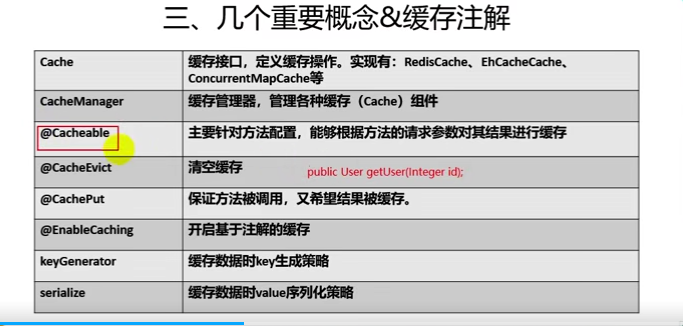

# 缓存

老的缓存JCache
https://blog.csdn.net/wilbertzhou/article/details/18888789

- spring从3.1后开始定义了自己的缓存
- 缓存常用注解  


## redis 

### 安装
- 服务端安装redis，可以在docker上安装
- redis基本命令
```
list
map
```

### redis功能和应用场景
功能：
- 可以设置key超时时间
- 可以通过列表实现分布式队列
- 可以支持发布订阅消息模式

应用场景：
- 数据缓存（商品数据、新闻、热点）
- 单点登录
- 秒杀抢购
- 访问排名
- 应用的模块开发

### redis 特性

- 多数据库支持
    - 不支持自定义数据库名词，有16个数据库
    - 每个数据库不能单独设置授权
    - 每个数据库之间不是完全隔离

- redis 几种结构

- 分布式锁实现
    - 资源共享问题
    - 数据安全性


### springboot 整合redis
    - 引入pom文件里面的starter
    - 配置redis
    
### redis序列化json对象,自定义缓存管理器
- springboot自定义缓存管理器

### 缓存增删改查

### redis缓存原理
```
1. redis-starter配置后容器中帮我们创建redisCacheManager
2. 然后创建RedisCache作为缓存组件
```
